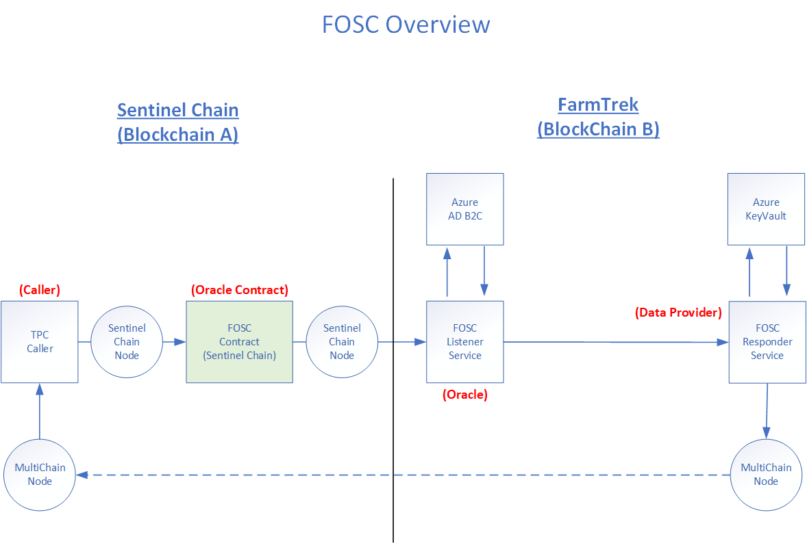

# FarmTrek Oracle on Sentinel Chain (FOSC)

The purpose of this document is to demonstrate a cross-chain oracle design that can be used by a caller of to request for information from one blockchain network via an oracle and data provider from another blockchain network.

## Blockchain Oracles

A blockchain oracle is the mechanism used by smart contacts to communicate with off-chain data sources. This is necessary for smart contracts to have meaningful interactions with the real world. For instance, oracles may be used to receive weather information from data sensors or obtain FX rates from real-time FX feeds providers. Most common use cases of 
oracles are from prediction, trading and gaming markets. This poses a problem because the data sources exist outside the trust boundary governed by the blockchain’s protocol.  The dependency on external data reintroduces the problem of trust back into a trustless network which is the epitome of what blockchains are designed to solve. The source of this feed is known as the oracle and the contract providing this feed is called the oracle contract. This paradox is known as the oracle problem. However, without interaction with off-chain data, the value of having on-chain logic cannot be fully realised. This is analogous to having a computer but without access to the public internet.

The reliance on real-world data sources can pose several challenges that cannot be addressed entirely by present day solutions. Since an oracle is essentially implemented as a smart contract in general, it cannot protect against confidentiality as request and response will eventually be exposed on the contract. A single source of data is easiest to implement but becomes a single point of failure whereas multiple data sources may not avoid collusion or plagiarism (aka freeloader). Using an on-chain oracle aggregator will depend on numbers, synchronisation and costs. The problem of blockchain oracles cannot be addressed effectively for general cases. But it may be implemented effectively for special cases. This project explores a special case involving the use of cross-chain oracle implementation between two blockchains (FarmTrek and Sentinel Chain) which we hope will inspire context driven design for the practical use of blockchains.

## FarmTrek

The FarmTrek solution, developed by InfoCorp Technologies, is designed to enable smallholder farmers to present proof of 
livestock ownership for use as collateral for loans in addressing financial inclusion in developing countries. FarmTrek 
is primarily designed from day one as a trusted data source for asset provenance using a lightweight private blockchain 
called Multichain, which is non-Turing complete for practicality reasons. The focus of the technology is in securing the 
first mile from physical asset to digital records. It combines physically  tamper-proof RFID tag (asset) with digitally 
immutable data source (blockchain) via an NFC smartphone (attestation). The separation of concerns allows FarmTrek to 
focus on becoming a trusted provenance data-centric blockchain that can be used as a source by oracles on different 
smart-contract blockchain platforms via a cross-chain oracle implementation.

## Sentinel Chain

Sentinel Chain is an EVM-based consortium blockchain platform designed to facilitate cross-border wholesale financing using
informal assets such as livestock for collaterals. In developing countries, the potential of livestock-backed financing model 
offered by FarmTrek can be maximised if given the ability to raise financing from off-shore developed countries to enable 
different competing parties to offer financing opportunities without centralised monopoly. Sentinel Chain is an example of a 
blockchain that is designed as a consumer of data offered by FarmTrek as part of its function. 

## Use Case

The **caller (data consumer)** requires access to private information held by multiple organisations (data providers). The caller exists on **Sentinel Chain** and can interact directly with an oracle contract to purchase the information using SENI (Sentinel Chain network token). And example of such a caller is a offshore financing company who is interested to access information relating to an asset that is held by various data providers within its own value chain. It would have been a simple request through public API or accessing the information through a public blockchain oracle. However, the data providers exists within an independent and closed-loop ecosystem that is not publicly accessible.

The **data providers** resides on a different blockchain (MultiChain) which are typically within an independent ecosystem, eg. a local supply chain. In this case, the supply chain utilises **FarmTrek** which facilitates livestock provenance and livestock-backed financing on MultiChain. Examples includes, veterinary services, insurance and financing bureaus. However, these data providers do not exist on Sentinel Chain. They are willing to sell their data through a data aggregator to the caller, but due to privacy and free-loading concerns, will only release the information to directly to the caller.

The **oracle** is a data aggregator that operates **FOSC** (oracle smart contract)and can assist the data providers in monetising their data. The oracle can receive requests from the caller, paid in tokens, and disseminate these requests to the data providers, paying them in fiat. However, the oracle cannot provide the caller details to the data provider for privacy of the caller which resides on a different chain from the data provider. Since the caller has no direct access to the oracle's database, there is no way to verify if the information comes from the data providers.

## Overview

In smart contract design, a request for data sent to a smart contract is made up of 2 parts. A transaction to place the request on the blockchain which typically requires payment using native tokens which returns a transaction id once the request is mined on the blockchain. A second call is made to retrieve the result using the transaction id, which is free, when the transaction is mined. In a typical oracle design, both transaction and call is made on the same blockchain.

In a cross-chain oracle scenario, the oracle design has to be decoupled into 2 components. One part of the oracle is responsible for receiving the transaction request from one chain. The other part of the oracle is responsible for managing response on the other chain.

## Terminologies

* **Caller**: Refers to the user making a request for FarmTrek data on Sentinel Chain and receiving the FarmTrek data on MultiChain.

* **CallerId**: Refers to the Caller's Sentinel Chain wallet address.

* **MultiChain**: A private blockchain used by FarmTrek.

* **FarmTrek**: A blockchain-based solution designed to manage tokenization and provenance of livestock.

* **Sentinel Chain**: A consortium side-chain to Ethereum.

* **FOSC**: FarmTrek Oracle on Sentinel Chain. Refers to the cross-chain oracle framework used between FarmTrek and Sentinel Chain.

## Components and Services

* **FOSC Smart Contract** - FarmTrek Orcle on Sentinel Chain (FOSC) smart contract is used by a caller on Sentinel Chain to request data from FarmTrek. It is also used by the FarmTrek Oracle Listener to update the caller with information on retrieving the requested info via MultiChain.

* **FOSC Responder** - Refers to the data service provider on FarmTrek responding the request from FOSC Listener.

* **FOSC Listener** - Refers to the Oracle service responding to the request events from FOSC.

* **FOSC Query** - Refers to the app client used by caller to request data from FOSC on Sentinel Chain and retrieve FarmTrek data from MultiChain.

## User Guides

* [FOSC Oracle's Guide](./doc/fosc-operator-guide.md)
* [FOSC Caller's Guide](./doc/fosc-developer-guide.md)

## Tools

* **Sentinel Chain Explorer** - Refer to this [link](http://52.163.206.199:52915/) link to monitor the Sentinel Chain transactions in real-time on Orion testnet. (https://github.com/SentinelChain/sentinel-chain-explorer-dotnet)

* **MultiChain Explorer** - Refer to this [link](http://52.149.150.62:2750/) to monitor the multichain transaction on FarmTrek testnet.

